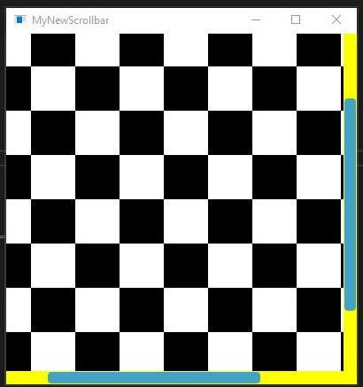
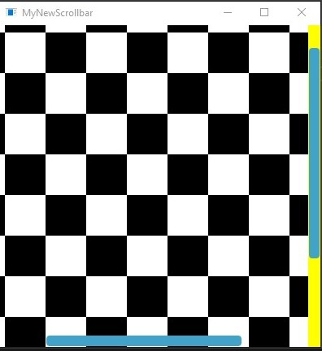
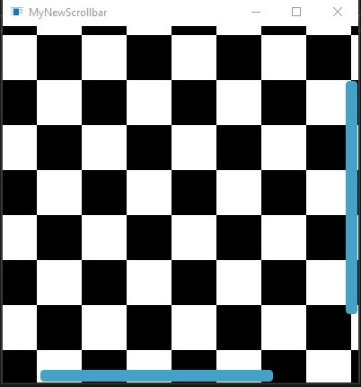

# osx-like scrollbar for JUCE

## Scrollbar on top of content vs on the side

```c++
viewport.setPlaceScrollbarOverContent(false, false); // this is the default
```



```c++
viewport.setPlaceScrollbarOverContent(false, true);
```



```c++
viewport.setPlaceScrollbarOverContent(true, true);
```




## Only show the scrollbar when we are actually scrolling 

* scrollbar initially not visible 
* it appears when user starts scrolling (e.g. mouse wheel) 
* disappear after 2secs (adjustable!) from last movement 

Use this: 

```c++
viewport.sethHideScrollbarWhenNotScrolling(bool hideVertical, hideHorizontal); 
```
